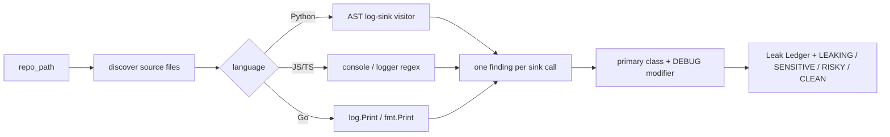

# Log Leak Map

**Everyone hunts secrets in git history. This hunts the lines that leak them at runtime.**

A secret can be perfectly absent from git history and still become exposed the moment an application writes it to a log sink.

Log Leak Map is a **read-only static analyzer** for Python, JavaScript/TypeScript, and Go-style logging calls. It finds **logging/output sinks** where sensitive-looking **names** are arguments — output that may later reach stdout, files, log aggregators, ticket systems, or copied debug output.

The killer artifact is the **Leak Ledger**: one row per sink (`path:line`), the call, optional **DEBUG** modifier, and a **redacted reconstruction** of what that sink could emit (`sk_live_•••`, `eyJ•••`, `user@••••`).

It does **not** claim to know Datadog vs CloudWatch. It claims something a judge can verify in one file: *this identifier is an argument to this log call.*

## The move

```python
logger.info(f"charging {card} key {STRIPE_SECRET_KEY}")
```

Secret scanners look at files at rest. This looks at **the sink**.

Demo fixture values are **synthetic**. The tool never needs a real production credential to flag the call site. Reconstruction is a shape, not an exfil.

## Example — planted demo (`fixtures/leak-demo`)

Full CLI output (banner counts = ledger rows = 5):

```text
================================================================
  LEAKING — 3 CONFIRMED SINKS, 1 SENSITIVE, 1 SUSPICIOUS
================================================================
Scanned=6  Skipped=0  Unavailable=0

THE LEAK LEDGER
  1. 🔴 CONFIRMED SINK  SECRET-IN-LOG  [DEBUG]  +PII-IN-LOG  api/auth.py:5
     sink  : print
     source: print("login", email, "token=", jwt)
     would : print("login", user@••••, "token=", eyJ•••)

  2. 🔴 CONFIRMED SINK  SECRET-IN-LOG  +PII-IN-LOG  api/payments.py:13
     sink  : logger.info
     source: logger.info(f"charging {card} key {STRIPE_SECRET_KEY}")
     would : logger.info(f"charging {4242••••} key {sk_live_•••}")

  3. 🟡 SUSPICIOUS  REQUEST-DUMP  [DEBUG]  api/webhook.py:9
     sink  : logger.debug
     source: logger.debug("payload: %s", request.body)
     would : logger.debug("payload: %s", {…request dump…})

  4. 🔴 CONFIRMED SINK  SECRET-IN-LOG  [DEBUG]  utils.js:5
     sink  : console.log
     source: console.log("DEBUG token", process.env.API_KEY);
     would : console.log("DEBUG token", ••••);

  5. 🟠 SENSITIVE  PII-IN-LOG  +EXCEPTION-LEAK  worker.py:12
     sink  : logging.error
     source: logging.error(f"failed for {user.email}: {e}")
     would : logging.error(f"failed for {user@••••}: {<exception>}")

NOT FLAGGED: api/server.py  logger.info("Server started on port 8080")
```

**3 + 1 + 1 = 5 rows.** One source line is never two findings. `[DEBUG]` is a modifier on leftover `print` / `console.log` / `.debug`. `+PII-IN-LOG` / `+EXCEPTION-LEAK` are extra signals on the same sink, not extra rows.

| What we confirmed | Severity |
|---|---|
| Secret / env / token-**like name** is an argument to a log/output call | 🔴 **CONFIRMED SINK** |
| Email / card / phone-shaped identifier is an argument | 🟠 **SENSITIVE** |
| Raw request body / headers object is an argument | 🟡 **SUSPICIOUS** |
| Exception object/string is an argument | 🟡 **SUSPICIOUS** |

**CONFIRMED SINK** confirms the *sink relationship*, not that the runtime value is a live secret. `token` can be a CSRF token or a test stub. The name still crossed into an output call.

`request.body` and `{e}` are not proven secrets. They stay **SUSPICIOUS** (or ride along as `+EXCEPTION-LEAK` on a SENSITIVE row).

## Test results

```text
$ python -m unittest tests.test_smoke -v

test_benign_server_not_flagged ... ok
test_cli_exit_codes ............... ok
test_debug_is_modifier ............ ok
test_demo_verdict_and_counts ...... ok
test_every_finding_has_path_line .. ok
test_js_env_key ................... ok
test_missing_path_degrades ........ ok
test_planted_classes_present ...... ok
test_reconstructed_shapes ......... ok
test_reproducibility .............. ok
test_secret_count ................. ok
test_severity_split ............... ok

Ran 12 tests in 0.402s
OK
```

| Check | Result |
|---|---|
| Demo verdict | **LEAKING — 3 CONFIRMED SINKS, 1 SENSITIVE, 1 SUSPICIOUS** |
| Ledger rows | **5** (equals 3+1+1; one per `path:line`) |
| Classes | `SECRET-IN-LOG` · `PII-IN-LOG` · `REQUEST-DUMP` · `EXCEPTION-LEAK` |
| `SENSITIVE-DEBUG` | **not a class** — `[DEBUG]` modifier only |
| Secret-like names at a sink | **CONFIRMED SINK** |
| `user.email` as primary | **SENSITIVE** |
| `request.body` as primary | **SUSPICIOUS** |
| Benign `server.py` | **not flagged** |
| JS `process.env.API_KEY` | **1 row:** `SECRET-IN-LOG` `[DEBUG]` |
| Missing path | **CLEAN / 0 files** (no crash) |
| Re-run | **byte-identical** |
| `--fail-on confirmed` on demo | **exit 1** |
| `--fail-on confirmed` on empty dir | **exit 0** |

## Caught in the wild — what we observed

Not the planted fixture. Direct scan of a public GitHub tree.

**Repo:** [snyk/goof](https://github.com/snyk/goof) (Snyk's vulnerable Node demo)  
**Commit:** `add14ba59e98240d9e00a235dd7d42cd61ae9912`  
**Command:** `python log_leak.py <checkout>`  
**Date:** 2026-09-04

Full output for that tree (banner counts = ledger rows = 5):

```text
LEAKING — 1 CONFIRMED SINK, 0 SENSITIVE, 4 SUSPICIOUS
Scanned=10

  1. 🔴 CONFIRMED SINK  SECRET-IN-LOG  [DEBUG]  app.js:84
     source: console.log('token: ' + token);
     would : console.log('token: ' + eyJ•••);

  2. 🟡 SUSPICIOUS  EXCEPTION-LEAK  [DEBUG]  routes/index.js:175
     source: console.log(err);

  3. 🟡 SUSPICIOUS  EXCEPTION-LEAK  [DEBUG]  routes/index.js:177
     source: console.log('Error (' + err + '):' + stderr);

  4. 🟡 SUSPICIOUS  EXCEPTION-LEAK  [DEBUG]  routes/users.js:41
     source: console.error(err)

  5. 🟡 SUSPICIOUS  EXCEPTION-LEAK  [DEBUG]  typeorm-db.js:45
     source: console.error(err)
```

**1 + 0 + 4 = 5 rows.**

Matching source at that commit for the CONFIRMED SINK:

```javascript
var token = 'SECRET_TOKEN_f8ed84e8f41e4146403dd4a6bbcea5e418d23a9';
console.log('token: ' + token);
```

**What we observed:** a logging sink carrying a token-like identifier in this public repository. That is a static relationship (name → call), not proof the process emitted that value in someone's production.

Reconstruction redacts; it does not print the literal token from disk into the “would” line. The four `err` rows are **SUSPICIOUS** exception sinks, not secrets.

Reproduce the same tree:

```bash
git clone https://github.com/snyk/goof.git /tmp/goof
git -C /tmp/goof checkout add14ba59e98240d9e00a235dd7d42cd61ae9912
python log_leak.py /tmp/goof
```

## Quick start

```bash
cd log-leak-map
python log_leak.py fixtures/leak-demo
```

Expected in ~1s: **LEAKING — 3 CONFIRMED SINKS, 1 SENSITIVE, 1 SUSPICIOUS**, five ledger rows, `server.py` clean.

```bash
python -m unittest tests.test_smoke -v
```

## Usage

```bash
python log_leak.py [repo_path] [--scope GLOBS] [--deps] [--format md|text]
                   [--out FILE] [--fail-on confirmed|suspicious|any|none]
```

| Flag | What it does |
|---|---|
| `repo_path` | Repo (or single file) to scan. Default: `.` |
| `--scope` | Comma-separated globs, e.g. `api/*.py,*.js` |
| `--deps` | Also walk `node_modules` / `vendor` / `site-packages` |
| `--format` | `md` (default) or `text` |
| `--fail-on` | CI gate. `confirmed` → exit 1 only on **CONFIRMED SINK** rows |

Exit codes: `0` ok · `1` threshold hit · `2` unexpected error.

## Classes (canonical)

Four classes. **DEBUG is a modifier, not a class.**

| Class | What the AST/regex actually saw | Default severity |
|---|---|---|
| `SECRET-IN-LOG` | Token / key / password / `process.env` / `os.environ` **identifier** is an argument | 🔴 CONFIRMED SINK |
| `PII-IN-LOG` | Email / card / phone / SSN-shaped **identifier** is an argument | 🟠 SENSITIVE |
| `REQUEST-DUMP` | `request.body` / headers / cookies / payload object is an argument | 🟡 SUSPICIOUS |
| `EXCEPTION-LEAK` | Exception object/string (`e`, `err`, `exc`) is an argument | 🟡 SUSPICIOUS |

When a line matches more than one class, the strongest wins as the row; others appear as `+CLASS`. Leftover `print` / `console.log` / `.debug` appear as `[DEBUG]`.

## Failure behavior

Never crashes the run for one bad file.

- Unreadable / oversized / binary → **SKIPPED** or **UNAVAILABLE** (degradation ledger)
- Python parse error → line-based fallback
- Missing path → **CLEAN**, 0 files scanned
- PII-only sinks → verdict **SENSITIVE**, not **LEAKING**
- Request/exception-only sinks → verdict **RISKY**, not **LEAKING**

## Architecture



Python stdlib only. Read-only. Zero adapters. Static analysis only.

```text
log-leak-map/
├── log_leak.py              # CLI
├── logleak/                 # discover · patterns · scan · report
├── fixtures/leak-demo/      # planted LEAKING repo
├── tests/test_smoke.py
└── play/                    # Rote wrapper (publish after GitHub push)
```

## What this is not

Not a git-history secret scanner. Not a runtime proxy. Not proof a given pipeline is a vendor aggregator. Not a rewriter — recommendations only.

**The claim:** we show you the exact logging sinks where sensitive-looking data crosses from your application into its observable output.
